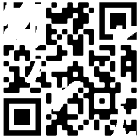
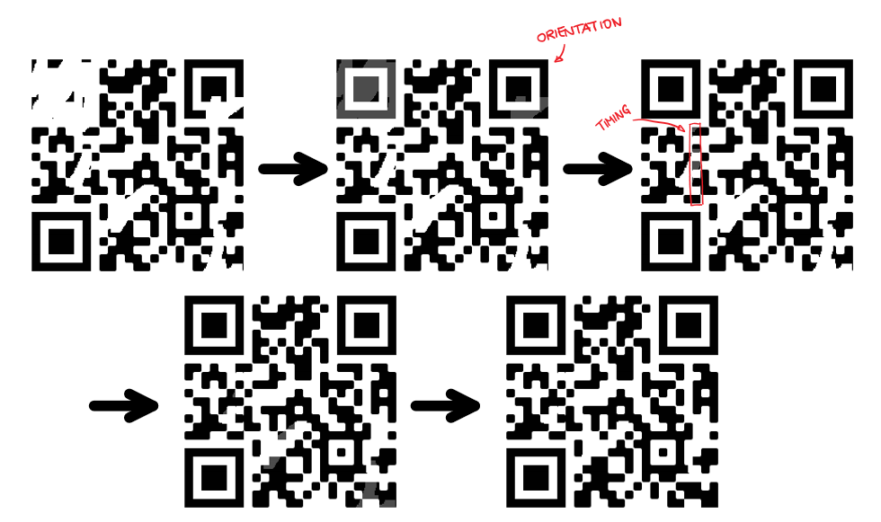

# Broken QR - 100 points
##### Message
Can you scan this QR code for me?
##### File

##### Solution
In this task, above QR code had to be restored into a scannable format. My main resource for this task was the article "Wounded QR codes" by DataGenetics (https://www.datagenetics.com/blog/november12013/index.html).

I started by restoring the positioning markers in the top left and top right corner by simply copying the one from the bottom left corner into their positions. Then, I fixed the left timing mark by copying the other one, rotating it by 90 degrees and putting it in the correct position. My last step was to copy a single black square and insert it at any position where remains indicated former black markers. However, that step was probably optional as it restored no markers essential for scanning a QR code. I used the open source image editor Krita.

Upon scanning the resulting QR code, I found the flag:
```sh
flag{d4mn_it_w0nt_sc4n}
```