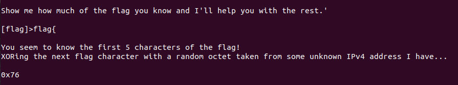

# One Byte at a Time - 50 points
##### Message
challenges.ctfd.io:30468
##### Solution
Via ``` nc challenges.ctfd.io 30468 ```, one could enter the part of the flag one already knew and if it was correct, the site returned the following:

My first approach was trying to brute force the site, but as it reacted extremely slowly I tried another approach. By knowing that the flags start with "flag{", I figured I could obtain at least parts of the unknown IPv4 XORed with the following character of the flag. As XORing is associative and commutative, I could just XOR the suggested hex value for the parts of the flag I already knew. This way, I figured out three of the four octets in the IPv4 address: 119, 16 and 2.
Now, I XORed all three values with each hint the site gave me, chose the most plausible outcome, checked whether it was right and then repeated that process for the next letter. I ended up with the following flag:
```
flag{f0ll0w_th3_whit3_r@bb1t}
```