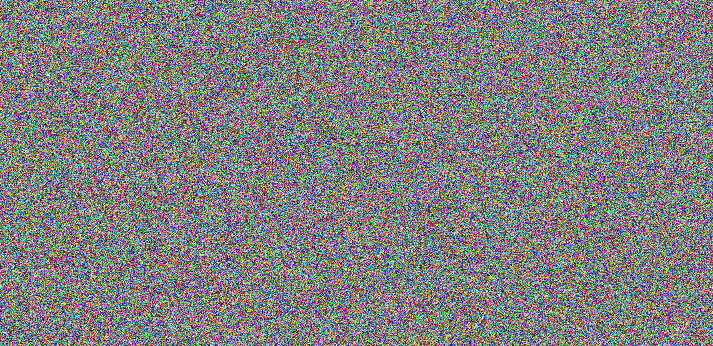

# Secret Images - 125 points
##### Message
We discovered Arasaka operatives sending wierd pictures to each other. It looks like they may contain secret data. Can you find it?
##### Content
 
##### Solution
The two files look like they have both been encrypted with the same XOR key. Here's a nice explanation for what XOR is and what properties it has: https://accu.org/journals/overload/20/109/lewin_1915/. 
While XOR encrypting one image with a key is quite secure, repeating the same key twice makes it possible to find out the contents of the original, unencrypted images. By assuming that both files have been encrypted with the same key, we can figure the following equations.
```
img1 ^ key = enc_img1
img2 ^ key = enc_img2
```
As we have crypted1.png and crypted2.png given, we can make a new equation and solve it for the original images:
```
enc_img1 ^ enc_img2 = img1 ^ key ^ img2 ^ key
```
As XORing something with itself always returns zero, the two occurences of the key cancel each other out.
```
enc_img1 ^ enc_img2 = img1 ^ img2
```
This means that by XORing the two images given with each other, we'll end up with an image of the unencrypted images XORed with each other. In practice, this can be done with the following command: (1)
```convert crypted1.png crypted2.png -fx "(((255*u)&(255*(1-v)))|((255*(1-u))&(255*v)))/255" decrypted.png```
Running the command confirmed the hypothesis that both images had been encrypted with the same key and I ended up with the following image:

```
flag{otp_reuse_fail}
```
(1) Note that you have to install imagemagick first, e.g. by running ```sudo apt install imagemagick-6.q16``` (or any other version)
##### Resources
General information on XOR: https://accu.org/journals/overload/20/109/lewin_1915/
Command for XORing two images: https://stackoverflow.com/questions/8504882/searching-for-a-way-to-do-bitwise-xor-on-images
